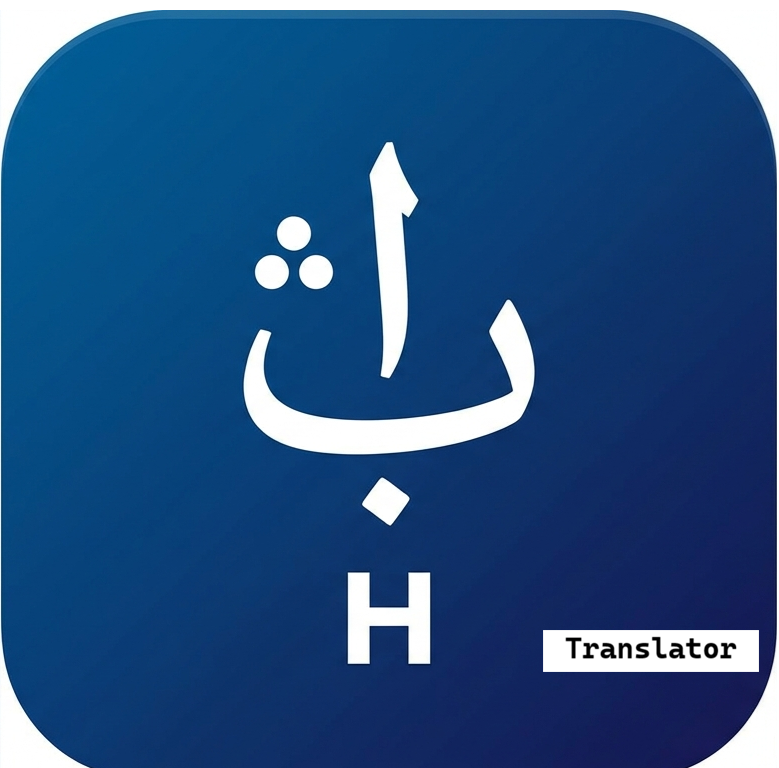

# Ajami Translator — English to Hausa Ajami

<p align="center">
  
</p>

An open-source web app that translates **English text into Hausa**, then renders it in **Hausa Ajami script** — the Arabic-derived writing system Hausa scholars have used since the 17th century.

> Part of the **Ajami Suite** — a set of open tools for digital Ajami literacy.
> See also: [Ajami Keyboard](https://github.com/ajami-suite/ajami-keyboard) · [Ajami Learn](https://github.com/ajami-suite/ajami-learn)

🌐 **Live at:** [ajami-suite.github.io/ajami-translator](https://ajami-suite.github.io/ajami-translator)

---

## How It Works

```
English Text
     │
     ▼
[English → Hausa (Latin)]     ← Helsinki-NLP opus-mt-en-ha via HuggingFace API
     │
     ▼
[Hausa (Latin) → Ajami Script] ← Rule-based phoneme-to-glyph engine (JavaScript)
     │
     ▼
Ajami Output  (copy to clipboard or use with Ajami Keyboard)
```

### Step 1 — Translation
Uses the [`Helsinki-NLP/opus-mt-en-ha`](https://huggingface.co/Helsinki-NLP/opus-mt-en-ha) model via the HuggingFace Inference API — free, no API key needed for basic use.

### Step 2 — Ajami Rendering
A rule-based JavaScript engine maps Hausa Latin phonemes to their Ajami glyphs following the **West African / Warsh / Kano** orthography tradition. The mapping is derived from the shared `corpus/hausa_ajami_characters.json` used across the Ajami Suite.

---

## Features

- Translate English → Hausa → Ajami in one click
- Copy Hausa (Latin) or Ajami output to clipboard
- Eight example phrases to get started instantly
- Works on desktop and mobile
- No install, no account, no data stored
- Keyboard shortcut: `Ctrl+Enter` / `Cmd+Enter` to translate

---

## Deployment (GitHub Pages)

1. Fork or clone this repository
2. Go to **Settings → Pages**
3. Set source to `main` branch, root folder `/`
4. Your translator is live at `https://yourusername.github.io/ajami-translator`

That's it — one HTML file, zero build step.

---

## Project Structure

```
ajami-translator/
├── index.html          ← Entire app (HTML + CSS + JS, single file)
├── assets/
│   └── logo.png        ← App logo (placeholder)
└── README.md
```

The transliteration engine and phoneme map live directly in `index.html`. To extract them into a separate module:

```
ajami-translator/
├── index.html
├── js/
│   ├── transliterator.js   ← phoneme engine
│   └── api.js              ← HuggingFace fetch logic
└── css/
    └── style.css
```

---

## Orthography

The Ajami rendering follows the **West African / Warsh / Kano** tradition:

| Sound | Glyph | Note |
|---|---|---|
| b | ب | Standard Ba |
| sh | ش | Shin — digraph handled before single s |
| f | ڢ | West African Fa — single dot below |
| k/q | ڧ | West African Qaf — single dot above |
| ɓ | ٻ | Hausa implosive b |
| ɗ | ڟ | Hausa implosive d |
| g | ݣ | Hard g |
| ƴ | ۑ | Glottalized y |
| e | ٜ | Hausa Imala vowel |
| n (final) | ں | Dotless Nun at word endings |
| aa | ا | Long a |
| ii | ي | Long i |
| uu | و | Long u |

---

## Accuracy Note

Machine translation to Hausa is imperfect — NLLB and opus-mt models perform better on common phrases and worse on complex grammar or idioms. The Ajami rendering is rule-based and may miss regional orthographic variants. Use as a learning aid and cultural bridge, not a certified translation.

If you find a systematic error in the phoneme mapping, please open an issue or submit a PR to update the `PHONEME_MAP` in `index.html`.

---

## Roadmap

- [x] v1.0 — English → Hausa → Ajami, single-page web app
- [ ] v1.1 — HuggingFace API key support for higher rate limits
- [ ] v1.2 — Wolof Ajami output option
- [ ] v1.3 — Fulfulde Ajami output option
- [ ] v1.4 — Share translated text as image (for social media)
- [ ] v2.0 — Android app wrapping the same engine
- [ ] v2.1 — Offline mode using on-device model (ONNX/TFLite)
- [ ] v3.0 — Integration with Ajami Keyboard (paste directly into keyboard)

---

## How to Make Corrections

### Report a transliteration error
Open a [GitHub Issue](../../issues/new) using the format:
> `[Transliteration] "X" in Hausa should render as Y not Z in Ajami`

### Fix it yourself
The entire transliteration engine is in `index.html` under `const PHONEME_MAP`. Each entry is:
```javascript
{ lat: 'sh', ajm: 'ش' }   // Latin input → Ajami glyph
```
Edit the relevant entry, test in your browser, and submit a Pull Request.

---

## Contributing

This project welcomes contributions from developers, linguists, Hausa speakers, and Ajami scholars. The phoneme map is the most important artifact — if you have knowledge of regional Hausa Ajami traditions that differ from the Kano/Warsh convention used here, please share it as an issue. Multiple orthographic traditions can be supported as toggle options in future versions.

### Resources
- [African Ajami Library, Boston University](https://www.bu.edu/pardeeschool/research/african-studies-center/african-ajami-library/)
- [Readers in Ajami Project (BU)](https://sites.bu.edu/nehajami/)
- [Helsinki-NLP opus-mt-en-ha model](https://huggingface.co/Helsinki-NLP/opus-mt-en-ha)
- [r12a Hausa Ajami orthography notes](https://r12a.github.io/scripts/arab/ha.html)
